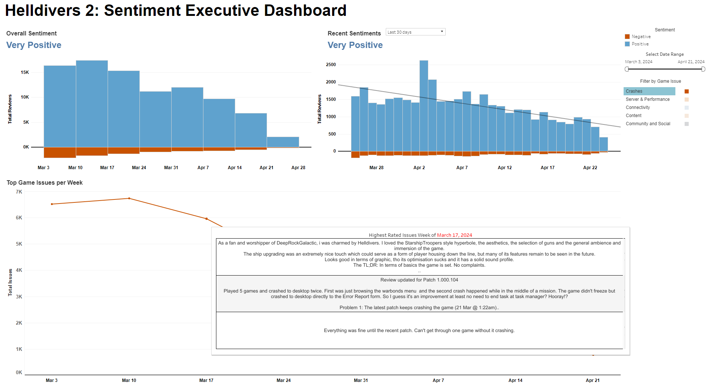

[**➡️CHECK THE TABLEAU DASHBOARD HERE**⬅️](https://public.tableau.com/app/profile/pjvillasista/viz/Helldivers2ExecutiveSentimentDashboard/Dashboard1)

# Project Overview

Helldivers 2, developed by a passionate team at Arrowhead Studios, has taken the gaming world by storm in 2024. With a development team of 100 creators, this title has become an instant hit among indie and mainstream audiences alike. Unlike many larger studios that may lose touch with their player base, Arrowhead Studios prides itself on creating games that they personally want to play and continuously listening to their community's feedback. This close interaction with players and commitment to quality has made Helldivers 2 not only a commercial success but also a beloved part of many gamers' libraries. The game’s design reflects a deep understanding of fun, challenge, and replayability, which are core to its widespread appeal.

## Objective

The main objective of this project is to develop a tool that assists the developers in identifying and addressing issues that PC users experience while playing Helldivers 2 on Steam. This tool aims to enhance the gaming experience by ensuring high performance and engagement levels through continuous improvements based on player feedback.

## Key Features

- **Filterable Dates**: Allows the team to view issues from specific periods, helping pinpoint when certain problems started and track improvements over time.
- **Sentiment Analysis**: By analyzing the sentiment of user reviews and feedback, the tool highlights overall player mood and satisfaction, which is crucial for maintaining a positive community.
- **Issue Categorization**:
  - **Crashes**: Frequent crashes are a major deterrent for players, leading to frustration and disengagement. Identifying patterns in crash reports can help swiftly address these issues.
  - **Connectivity Issues**: Online gameplay is core to Helldivers 2, making stable connectivity paramount. The tool helps monitor and rectify connectivity complaints.
  - **Content Issues**: Feedback about repetitive content and a lack of variety can be used to guide new updates, including a wider range of missions and game modes to enhance replayability.
  - **Community and Social Interaction**: Engaging the community and fostering social interactions are key for an online game's longevity. Feedback in this category will be used to improve social features and community engagement strategies.

## Technologies Used

- **Python**: Utilized for scripting, data scraping, data cleaning and calling the Steamworks API to gather real-time data and feedback from the Steam community.
  - **BERTopic**: Utilized for topical modeling to identify the top topics that users are talking about. This allows the team to pinpoint emerging trends and issues in player feedback, facilitating targeted improvements.
- **Tableau**: Employed to visualize data and insights derived from the analysis, enabling the team to make informed decisions quickly and efficiently.
- **Apache Airflow**: Used for scheduling tasks, ensuring that data collection and analysis are performed consistently every week, keeping the feedback loop current and relevant.

## Sources
- [SteamWeb Unofficial API] (https://github.com/Revadike/InternalSteamWebAPI/wiki)

## Findings

Through the continuous use of our tool, we have uncovered significant insights regarding the performance and player experience of Helldivers 2 on PC:

- **Server and Performance Issues**: These issues were most prominent at the game’s launch. The unprecedented success and player influx exceeded expectations, leading to initial server overloads. Thankfully, these issues have shown a marked decrease as the team swiftly scaled the server capacities to better meet demand.

- **Connectivity Issues**: There has been a significant reduction in connectivity-related complaints. Currently, less than 40 reviews mention such issues, indicating improvements in server response and stability.

- **Content Diversity and Engagement**: While overall content issues have decreased, a recurring theme in player feedback highlights a lack of diversity and the monotonous nature of missions. This points to a potential area for development to introduce more varied and engaging content to enrich the player experience.

- **Crashes**: This category remains a critical concern. Following a patch in March, there was a spike with over 6,000 reviews reporting crash issues. Although the frequency of such reports has lessened, there were still around 1,000 reviews citing crashes as of April 21. This ongoing issue indicates a need for further investigation and swift resolution to maintain player trust and satisfaction.

## Importance of This Tool for an Indie Gaming Company

For an indie gaming company such as Arrowhead Studios, this tool is not just a convenience—it's a strategic asset. Indie developers often face intense competition from larger studios with more resources. As such, the ability to rapidly and efficiently adapt to player feedback can significantly distinguish an indie game in a crowded market.

- **Enhanced Player Satisfaction**: By swiftly identifying and addressing issues, the tool helps maintain and increase player satisfaction, which is crucial for word-of-mouth marketing and long-term success. Satisfied players are more likely to recommend the game to others, driving organic growth.

- **Community Engagement**: The tool allows the development team to stay closely engaged with their community by monitoring and responding to player feedback. This ongoing dialogue between players and developers fosters a loyal community and enhances the game’s reputation.

- **Agile Development**: With the insights gained from the tool, the development team can quickly pivot or iterate on their content and features. This agility allows them to continuously improve the game, ensuring it remains relevant and exciting to both new and existing players.

- **Market Insight**: Understanding player behavior and preferences helps the studio make informed decisions about future projects or updates. The ability to anticipate and meet player demands can set an indie studio apart from its competitors.
